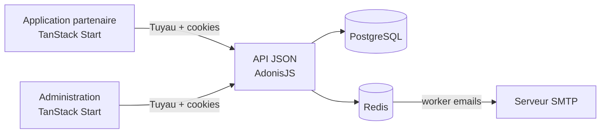

<div align="center">

# EPARTIM

<!-- markdownlint-disable MD013 -->

[Vue d'ensemble](#vue-densemble) · [Démarrage](#démarrage-rapide) ·
[Architecture](#architecture) · [Commandes](#commandes-utiles) ·
[Documentation](#documentation-métier-et-technique)

</div>

---

## Vue d'ensemble

epartim accompagne les entreprises dans la mise en place de dispositifs d'épargne salariale :
PEI, PER COL-I, participation, intéressement et prime de partage de la valeur. Sa plateforme
partenaires « Go ! » relie les équipes epartim, les cabinets et conseillers distributeurs, les
entreprises souscriptrices et les opérateurs financiers.

Ce monorepo construit la **V2 de cette plateforme** autour de trois surfaces :

- une application client pour les partenaires ;
- une administration interne pour piloter les utilisateurs et leurs accès ;
- une API JSON partagée, typée de bout en bout avec Tuyau.

Le contexte métier couvre également les bulletins de souscription électroniques (**BSE**), les
flux apporteurs et EER avec **Amundi**, les commissions **AXA** et la signature électronique.

> [!IMPORTANT]
> Le code actuel implémente principalement l'authentification, le cycle de vie des comptes et
> l'administration des utilisateurs. Les parcours BSE, les échanges Amundi et le calcul des
> commissions AXA sont documentés comme cible métier, mais ne doivent pas être considérés comme
> entièrement implémentés dans ce dépôt.

## Architecture

```text
epartim/
├── apps/
│   ├── api/                 # API AdonisJS, PostgreSQL, files Redis, e-mails et tests
│   ├── client/              # Application partenaires TanStack Start — port 3000
│   └── admin/               # Administration TanStack Start — port 3001
├── packages/
│   └── ui/
│       ├── react/           # Composants React partagés et Storybook
│       └── theme/           # Tokens et CSS Tailwind généré
├── docs/                    # Spécifications métier et techniques de la V2
├── package.json             # Scripts racine et versions Node.js/pnpm
├── pnpm-workspace.yaml      # Définition des workspaces
└── turbo.json               # Graphe de tâches Turborepo
```



| Domaine | Technologies principales |
| --- | --- |
| Monorepo | Node.js 24, pnpm 10.33.2, Turborepo |
| API | TypeScript, AdonisJS 7, Lucid, Bouncer, VineJS, Tuyau |
| Frontends | React 19, TanStack Start, Router, Query et Form, Vite |
| Interface | Tailwind CSS 4, Base UI, Storybook, thème partagé |
| Données | PostgreSQL 15, Redis 7 |
| Qualité | Biome, TypeScript, Japa, GitHub Actions |

L'API suit une architecture **feature-first** séparée par audience (`admin` et `client`). Les
contrôleurs, services, policies, jobs, mails et tests restent proches du domaine qu'ils servent.
Les deux frontends consomment le registre de routes généré par l'API au lieu de maintenir un
client HTTP séparé.

## Démarrage rapide

### Prérequis

- [Node.js](https://nodejs.org/) `24`
- [pnpm](https://pnpm.io/) `10.33.2`
- [Docker](https://www.docker.com/) avec Docker Compose

### Installation

Depuis la racine du dépôt :

```bash
corepack enable
pnpm install

cp apps/api/.env.example apps/api/.env
cp apps/client/.env.example apps/client/.env
cp apps/admin/.env.example apps/admin/.env

pnpm adonis generate:key
docker compose --env-file apps/api/.env -f apps/api/docker-compose.yml up -d
pnpm adonis migration:run
pnpm dev
```

`pnpm dev` lance le graphe Turborepo. Pour l'API, il démarre également Docker Compose et le
worker qui traite la file `emails`.

| Service | Adresse locale |
| --- | --- |
| Application partenaire | `http://localhost:3000` |
| Administration | `http://localhost:3001` |
| API | `http://localhost:3333` |
| Boîte mail smtp4dev | `http://localhost:5001` |

> [!WARNING]
> Les valeurs des fichiers `.env.example` sont réservées au développement local. N'utilisez
> jamais de secrets, de données personnelles, de fichiers partenaires ou d'informations issues
> du dossier privé `context/` dans les fixtures, les captures ou la documentation versionnée.

## Configuration

Les fichiers d'exemple constituent la référence :

- [`apps/api/.env.example`](apps/api/.env.example) : serveur, sessions, PostgreSQL, SMTP, Redis,
  files de tâches, limiteur et stockage ;
- [`apps/client/.env.example`](apps/client/.env.example) : URL de l'API et de l'administration ;
- [`apps/admin/.env.example`](apps/admin/.env.example) : URL de l'API et de l'application client.

Les requêtes frontend utilisent des cookies de session. Les origines des applications et la
configuration CORS de l'API doivent donc rester cohérentes.

## Commandes utiles

### Workspace

| Commande | Description |
| --- | --- |
| `pnpm dev` | Lance les applications et services de développement. |
| `pnpm build` | Construit le workspace selon les dépendances Turbo. |
| `pnpm typecheck` | Vérifie les types TypeScript. |
| `pnpm test` | Exécute les tests disponibles dans le workspace. |
| `pnpm code-quality` | Contrôle le formatage, le lint et les imports avec Biome. |
| `pnpm code-quality:fix` | Applique les corrections sûres de Biome. |
| `pnpm adonis <commande>` | Exécute une commande Ace dans l'API. |

### Cibles individuelles

```bash
# API
pnpm --filter @workspace/api dev
pnpm --filter @workspace/api worker
pnpm --filter @workspace/api test
pnpm --filter @workspace/api typecheck

# Applications
pnpm --filter @workspace/client dev
pnpm --filter @workspace/admin dev

# Design system
pnpm --filter @workspace/ui-react dev
pnpm --filter @workspace/ui-theme generate:tailwind
```

> [!NOTE]
> Les e-mails d'invitation, de réinitialisation, de changement de mot de passe et de suppression
> de compte sont asynchrones. Le worker `emails` doit être actif pour qu'ils soient envoyés.

## Tests et qualité

Les tests API sont colocalisés avec les fonctionnalités :

- `*.unit.spec.ts` pour les policies, jobs et mails ;
- `*.e2e.spec.ts` pour les contrôleurs HTTP ;
- `apps/api/bootstrap.ts` pour préparer la base de test et démarrer le serveur.

La CI GitHub Actions exécute :

1. les contrôles Biome ;
2. les typechecks affectés ;
3. les tests avec PostgreSQL et Redis ;
4. les builds affectés.

Avant d'ouvrir une pull request :

```bash
pnpm code-quality
pnpm typecheck
pnpm test
pnpm build
```

## Fichiers générés

Ne modifiez pas manuellement :

- `apps/api/.adonisjs/**`
- `apps/api/ace.js`
- `apps/api/database/schema.ts`
- `apps/client/src/routeTree.gen.ts`
- `apps/admin/src/routeTree.gen.ts`
- `apps/client/src/libs/i18n/build/**`
- `apps/admin/src/libs/i18n/build/**`
- `packages/ui/theme/src/tailwind.css`

Les registres AdonisJS/Tuyau sont générés pendant le build de l'API, les bundles de traduction
pendant l'installation et le développement des frontends, et le CSS Tailwind depuis
`packages/ui/theme/src/tokens.ts`.

## Déploiement

Chaque application dispose de son propre `Dockerfile` :

- l'API est compilée avec AdonisJS, exécute les migrations au démarrage et expose le port `8080` ;
- le client et l'administration produisent des applications statiques servies par Nginx sur le
  port `80` ;
- `VITE_API_BASE_URL` est injectée à la construction des frontends.

## Documentation métier et technique

Le dossier [`docs/`](docs/README.md) formalise la cible de reconstruction. Il complète le code,
mais ne prouve pas à lui seul qu'une fonctionnalité est déjà disponible.

- [Authentification et accès](docs/authentication/README.md)
- [Acteurs, rôles et périmètres](docs/actors-and-access/README.md)
- [Parcours BSE](docs/bse/README.md)
- [Schéma de données cible](docs/database/schema.md)

Le contexte opérationnel privé a servi à restituer le vocabulaire et les enjeux métier de ce
README. Il ne doit pas être publié ni utilisé comme source de données de développement.
