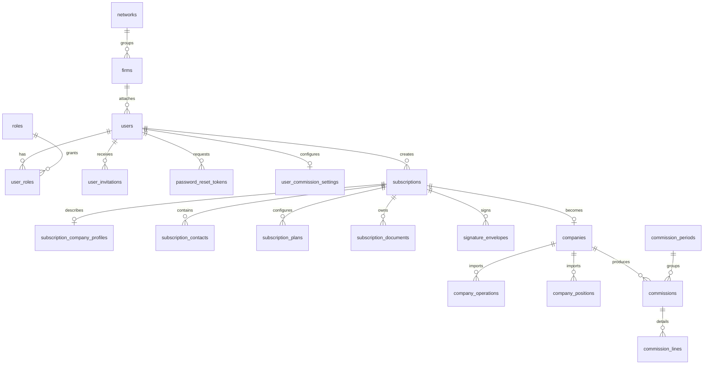

# Schema base de donnees cible

Ce document decrit le schema cible pour `epartim-v2`.

La base technique est AdonisJS 7, Lucid ORM et le guard d'authentification par
session deja present dans `apps/api/config/auth.ts`.

## Principes

- Conserver la convention Adonis `users.email` + `users.password` pour
  l'authentification par mot de passe.
- Ne pas creer de table `sessions` tant que le guard utilise les sessions cookie
  Adonis.
- Ne pas creer de table `auth_access_tokens` tant qu'aucun guard API token n'est
  utilise.
- Sortir les invitations et les resets de mot de passe dans des tables dediees
  pour permettre expiration, revocation, usage unique et audit.
- Modeliser les roles metier dans `roles` et `user_roles` plutot qu'un champ
  libre sur `users`.
- Garder les montants en centimes + devise.
- Utiliser des chaines controlees par contraintes `CHECK` pour les statuts et
  types metier, sauf si un domaine impose une table de reference.
- Utiliser `bigint` auto-increment pour les identifiants Lucid.
- Garder les noms de colonnes en `snake_case`, avec `created_at` et `updated_at`.

## Vue d'ensemble

## Authentification et acces

### users

Compte applicatif authentifiable par Adonis.

| Colonne | Type | Contraintes |
| --- | --- | --- |
| id | bigint | primary key |
| firm_id | bigint | nullable, FK `firms.id`, `ON DELETE SET NULL` |
| email | varchar(254) | not null, unique |
| password | varchar | nullable |
| first_name | varchar | nullable |
| last_name | varchar | nullable |
| mobile_phone | varchar | nullable |
| status | varchar | not null, default `invited` |
| amundi_user_id | varchar | nullable |
| amundi_employee_type | varchar | nullable, default `conseiller_pdf` |
| partnership_provider | varchar | nullable |
| last_login_at | timestamp | nullable |
| disabled_at | timestamp | nullable |
| created_at | timestamp | not null |
| updated_at | timestamp | not null |

Contraintes :

- `email` unique.
- `status` dans `invited`, `active`, `disabled`.
- `partnership_provider` dans `lilycare` lorsqu'il est renseigne.
- `password` peut rester `NULL` pour un compte invite non active.
- La connexion doit refuser tout compte dont `status != active` ou dont
  `password IS NULL`.

Notes Adonis :

- Le modele `User` doit continuer a utiliser `withAuthFinder`.
- Le service de login doit charger l'utilisateur par email, verifier le statut,
  puis verifier le mot de passe avec le hash service Adonis.
- Le presenter utilisateur ne doit jamais exposer `password`.

### roles

Role metier stable.

| Colonne | Type | Contraintes |
| --- | --- | --- |
| id | bigint | primary key |
| code | varchar | not null, unique |
| label | varchar | not null |
| created_at | timestamp | not null |
| updated_at | timestamp | not null |

Codes initiaux :

- `administrator`
- `go_commercial`
- `network_manager`
- `distributor`
- `company_mandatary`
- `partner`

### user_roles

Association entre un compte et ses roles.

| Colonne | Type | Contraintes |
| --- | --- | --- |
| id | bigint | primary key |
| user_id | bigint | not null, FK `users.id`, `ON DELETE CASCADE` |
| role_id | bigint | not null, FK `roles.id`, `ON DELETE RESTRICT` |
| created_at | timestamp | not null |
| updated_at | timestamp | not null |

Contraintes :

- Unique `user_id, role_id`.

### user_invitations

Invitation d'activation d'un compte.

| Colonne | Type | Contraintes |
| --- | --- | --- |
| id | bigint | primary key |
| user_id | bigint | not null, FK `users.id`, `ON DELETE CASCADE` |
| invited_by_user_id | bigint | nullable, FK `users.id`, `ON DELETE SET NULL` |
| token_hash | varchar | not null, unique |
| email | varchar(254) | not null |
| sent_at | timestamp | nullable |
| expires_at | timestamp | not null |
| accepted_at | timestamp | nullable |
| revoked_at | timestamp | nullable |
| created_at | timestamp | not null |
| updated_at | timestamp | not null |

Regles :

- Expiration apres 7 jours.
- Un renvoi cree une nouvelle invitation et revoque l'invitation active
  precedente.
- Un compte invite devient `active` uniquement lorsque l'invitation est acceptee
  et que le mot de passe est defini.

### password_reset_tokens

Token de reset de mot de passe a usage unique.

| Colonne | Type | Contraintes |
| --- | --- | --- |
| id | bigint | primary key |
| user_id | bigint | not null, FK `users.id`, `ON DELETE CASCADE` |
| token_hash | varchar | not null, unique |
| expires_at | timestamp | not null |
| used_at | timestamp | nullable |
| created_at | timestamp | not null |
| updated_at | timestamp | not null |

Regles :

- Le reset concerne uniquement les comptes `active`.
- La reponse publique reste generique pour ne pas exposer l'existence d'un
  compte.
- Un token expire ou deja utilise est refuse.

### user_commission_settings

Parametrage commercial et commissionnement d'un utilisateur.

| Colonne | Type | Contraintes |
| --- | --- | --- |
| id | bigint | primary key |
| user_id | bigint | not null, unique, FK `users.id`, `ON DELETE CASCADE` |
| commission_referent_id | bigint | nullable, FK `users.id`, `ON DELETE SET NULL` |
| short_term_rate | decimal | nullable |
| middle_term_rate | decimal | nullable |
| long_term_rate | decimal | nullable |
| sienna_rate | decimal | nullable |
| created_at | timestamp | not null |
| updated_at | timestamp | not null |

## Organisation commerciale

### networks

Reseau commercial.

| Colonne | Type | Contraintes |
| --- | --- | --- |
| id | bigint | primary key |
| name | varchar | not null |
| amundi_org_id | varchar | nullable |
| created_at | timestamp | not null |
| updated_at | timestamp | not null |

Contraintes :

- Unique `name`.
- Unique `amundi_org_id` lorsqu'il est renseigne.

### firms

Cabinet ou organisation commerciale rattachee eventuellement a un reseau.

| Colonne | Type | Contraintes |
| --- | --- | --- |
| id | bigint | primary key |
| network_id | bigint | nullable, FK `networks.id`, `ON DELETE RESTRICT` |
| name | varchar | not null |
| amundi_org_id | varchar | nullable |
| created_at | timestamp | not null |
| updated_at | timestamp | not null |

Contraintes :

- Unique `name`.
- Unique `amundi_org_id` lorsqu'il est renseigne.

## Fichiers

### files

Metadonnees des fichiers stockes via Adonis Drive.

| Colonne | Type | Contraintes |
| --- | --- | --- |
| id | bigint | primary key |
| disk | varchar | not null |
| key | varchar | not null |
| filename | varchar | not null |
| content_type | varchar | nullable |
| size | integer | not null |
| checksum | varchar | nullable |
| created_at | timestamp | not null |
| updated_at | timestamp | not null |

Contraintes :

- Unique `disk, key`.

## Souscriptions BSE

### subscriptions

Dossier de souscription.

| Colonne | Type | Contraintes |
| --- | --- | --- |
| id | bigint | primary key |
| user_id | bigint | not null, FK `users.id`, `ON DELETE RESTRICT` |
| status | varchar | not null, default `draft` |
| current_step | integer | not null, default `1` |
| refusal_reason | text | nullable |
| submitted_at | timestamp | nullable |
| approved_at | timestamp | nullable |
| completed_at | timestamp | nullable |
| status_updated_at | timestamp | nullable |
| created_at | timestamp | not null |
| updated_at | timestamp | not null |

Statuts :

- `draft`
- `pending_validation`
- `refused`
- `approved`
- `signature_pending`
- `sent_to_amundi`
- `completed`
- `error`
- `cancelled`

Index :

- `user_id`
- `status`
- `current_step`

### subscription_steps

Etat de validation d'une etape BSE.

| Colonne | Type | Contraintes |
| --- | --- | --- |
| id | bigint | primary key |
| subscription_id | bigint | not null, FK `subscriptions.id`, `ON DELETE CASCADE` |
| step_code | varchar | not null |
| status | varchar | not null, default `pending` |
| validated_at | timestamp | nullable |
| created_at | timestamp | not null |
| updated_at | timestamp | not null |

Contraintes :

- Unique `subscription_id, step_code`.
- `step_code` dans `company_profile`, `kyc`, `contract_features`,
  `contract_fees`, `implementation_formalism`.

### subscription_status_events

Historique des transitions de statut.

| Colonne | Type | Contraintes |
| --- | --- | --- |
| id | bigint | primary key |
| subscription_id | bigint | not null, FK `subscriptions.id`, `ON DELETE CASCADE` |
| from_status | varchar | nullable |
| to_status | varchar | not null |
| reason | text | nullable |
| created_by_id | bigint | nullable, FK `users.id`, `ON DELETE SET NULL` |
| created_at | timestamp | not null |

### subscription_company_profiles

References entreprise de la souscription.

| Colonne | Type | Contraintes |
| --- | --- | --- |
| id | bigint | primary key |
| subscription_id | bigint | not null, unique, FK `subscriptions.id`, `ON DELETE CASCADE` |
| siret | varchar | nullable |
| siren | varchar | nullable |
| naf | varchar | nullable |
| corporate_name | varchar | nullable |
| legal_form | varchar | nullable |
| company_headcount | integer | nullable |
| tax_country | varchar | nullable |
| address_line_1 | varchar | nullable |
| address_line_2 | varchar | nullable |
| address_line_3 | varchar | nullable |
| postal_code | varchar | nullable |
| city | varchar | nullable |
| country | varchar | nullable |
| financial_year_closing_day | varchar | nullable |
| created_at | timestamp | not null |
| updated_at | timestamp | not null |

### subscription_contacts

Representants, signataires, habilitations Amundi et contacts.

| Colonne | Type | Contraintes |
| --- | --- | --- |
| id | bigint | primary key |
| subscription_id | bigint | not null, FK `subscriptions.id`, `ON DELETE CASCADE` |
| kind | varchar | not null |
| person_type | varchar | nullable |
| civility | varchar | nullable |
| first_name | varchar | nullable |
| last_name | varchar | nullable |
| company_name | varchar | nullable |
| function | varchar | nullable |
| email | varchar | nullable |
| mobile_phone | varchar | nullable |
| amundi_portal_id | varchar | nullable |
| is_signatory_on_kbis | boolean | nullable |
| created_at | timestamp | not null |
| updated_at | timestamp | not null |

Index :

- `subscription_id`
- `kind`

`kind` initial :

- `legal_representative`
- `administrative_correspondent`
- `amundi_authorization`
- `signatory`

### subscription_bank_accounts

Coordonnees bancaires de la souscription.

| Colonne | Type | Contraintes |
| --- | --- | --- |
| id | bigint | primary key |
| subscription_id | bigint | not null, unique, FK `subscriptions.id`, `ON DELETE CASCADE` |
| iban | varchar | nullable |
| bic | varchar | nullable |
| payment_method | varchar | nullable |
| sepa_signature_date | date | nullable |
| created_at | timestamp | not null |
| updated_at | timestamp | not null |

### subscription_pricing

Tarification de la souscription.

| Colonne | Type | Contraintes |
| --- | --- | --- |
| id | bigint | primary key |
| subscription_id | bigint | not null, unique, FK `subscriptions.id`, `ON DELETE CASCADE` |
| package_fees | varchar | nullable |
| subscription_fees_cents | integer | nullable |
| subscription_fees_currency | varchar | nullable |
| year_support_cost_cents | integer | nullable |
| year_support_cost_currency | varchar | nullable |
| entrance_fees_rate | decimal | nullable |
| entrance_fees_from | varchar | nullable |
| created_at | timestamp | not null |
| updated_at | timestamp | not null |

### subscription_kyc_profiles

Profil KYC entreprise.

| Colonne | Type | Contraintes |
| --- | --- | --- |
| id | bigint | primary key |
| subscription_id | bigint | not null, unique, FK `subscriptions.id`, `ON DELETE CASCADE` |
| regulated_activity | boolean | nullable |
| regulated_activity_reference | varchar | nullable |
| listed_company | boolean | nullable |
| listed_company_reference | varchar | nullable |
| bic_id | boolean | nullable |
| bearer_bonds_structure | boolean | nullable |
| bearer_bonds_structure_percentage | decimal | nullable |
| country_of_activity | varchar | nullable |
| country_of_activity_reference | varchar | nullable |
| country_provider | varchar | nullable |
| country_provider_reference | varchar | nullable |
| main_markets | varchar | nullable |
| main_markets_reference | varchar | nullable |
| created_at | timestamp | not null |
| updated_at | timestamp | not null |

### beneficial_owners

Dirigeants, beneficiaires effectifs, procurations et actionnaires principaux.

| Colonne | Type | Contraintes |
| --- | --- | --- |
| id | bigint | primary key |
| subscription_id | bigint | not null, FK `subscriptions.id`, `ON DELETE CASCADE` |
| kind | varchar | not null |
| name | varchar | nullable |
| function | varchar | nullable |
| shareholding_percentage | decimal | nullable |
| siren | varchar | nullable |
| birth_city | varchar | nullable |
| birth_date | date | nullable |
| nationality | varchar | nullable |
| tax_country | varchar | nullable |
| permanent_address | varchar | nullable |
| postal_address | varchar | nullable |
| created_at | timestamp | not null |
| updated_at | timestamp | not null |

### beneficial_owner_roles

Roles portes par un beneficiaire.

| Colonne | Type | Contraintes |
| --- | --- | --- |
| id | bigint | primary key |
| beneficial_owner_id | bigint | not null, FK `beneficial_owners.id`, `ON DELETE CASCADE` |
| role_code | varchar | not null |
| created_at | timestamp | not null |
| updated_at | timestamp | not null |

Contraintes :

- Unique `beneficial_owner_id, role_code`.

### subscription_plans

Dispositifs PEI / PER COL-i.

| Colonne | Type | Contraintes |
| --- | --- | --- |
| id | bigint | primary key |
| subscription_id | bigint | not null, FK `subscriptions.id`, `ON DELETE CASCADE` |
| plan_type | varchar | not null |
| subscription_method | varchar | nullable |
| existing_arrangement | boolean | nullable |
| transfer_amount | varchar | nullable |
| system_of_matching | boolean | nullable |
| calculation_method | varchar | nullable |
| limited_period_start | varchar | nullable |
| limited_period_end | varchar | nullable |
| created_at | timestamp | not null |
| updated_at | timestamp | not null |

Contraintes :

- Unique `subscription_id, plan_type`.
- `plan_type` dans `pei`, `per_col_i`.

### contribution_rules

Regles d'abondement rattachees a un dispositif.

| Colonne | Type | Contraintes |
| --- | --- | --- |
| id | bigint | primary key |
| subscription_plan_id | bigint | not null, FK `subscription_plans.id`, `ON DELETE CASCADE` |
| rule_type | varchar | not null |
| source_type | varchar | nullable |
| limit_type | varchar | nullable |
| percentage | varchar | nullable |
| max_percentage | decimal | nullable |
| amount_cents | integer | nullable |
| amount_currency | varchar | nullable |
| calculation_method | varchar | nullable |
| created_at | timestamp | not null |
| updated_at | timestamp | not null |

### contribution_rule_tiers

Tranches d'abondement.

| Colonne | Type | Contraintes |
| --- | --- | --- |
| id | bigint | primary key |
| contribution_rule_id | bigint | not null, FK `contribution_rules.id`, `ON DELETE CASCADE` |
| position | integer | not null, default `0` |
| starts_at_month | varchar | nullable |
| ends_at_month | varchar | nullable |
| greater_than | boolean | nullable |
| percentage | varchar | nullable |
| amount_cents | integer | nullable |
| amount_currency | varchar | nullable |
| created_at | timestamp | not null |
| updated_at | timestamp | not null |

### subscription_existing_agreements

Accords existants.

| Colonne | Type | Contraintes |
| --- | --- | --- |
| id | bigint | primary key |
| subscription_id | bigint | not null, FK `subscriptions.id`, `ON DELETE CASCADE` |
| agreement_type | varchar | not null |
| details | text | nullable |
| created_at | timestamp | not null |
| updated_at | timestamp | not null |

Contraintes :

- Unique `subscription_id, agreement_type`.

### voluntary_payment_rules

Regles de versement volontaire.

| Colonne | Type | Contraintes |
| --- | --- | --- |
| id | bigint | primary key |
| subscription_id | bigint | not null, unique, FK `subscriptions.id`, `ON DELETE CASCADE` |
| effective_date_start | date | nullable |
| effective_date_end | date | nullable |
| minimum_seniority | varchar | nullable |
| duration | varchar | nullable |
| formula | varchar | nullable |
| salary_proportion_percentage | decimal | nullable |
| salary_proportion_with_seniority_percentage | decimal | nullable |
| egalitary_percentage | decimal | nullable |
| created_at | timestamp | not null |
| updated_at | timestamp | not null |

### subscription_documents

Documents rattaches a une souscription.

| Colonne | Type | Contraintes |
| --- | --- | --- |
| id | bigint | primary key |
| subscription_id | bigint | not null, FK `subscriptions.id`, `ON DELETE CASCADE` |
| file_id | bigint | nullable, FK `files.id`, `ON DELETE SET NULL` |
| document_type | varchar | not null |
| status | varchar | not null, default `draft` |
| signature_date | date | nullable |
| created_at | timestamp | not null |
| updated_at | timestamp | not null |

Index :

- `subscription_id`
- `document_type`
- `status`

## Signatures electroniques

### signature_envelopes

Enveloppe de signature.

| Colonne | Type | Contraintes |
| --- | --- | --- |
| id | bigint | primary key |
| subscription_id | bigint | not null, FK `subscriptions.id`, `ON DELETE CASCADE` |
| provider | varchar | not null |
| provider_envelope_id | varchar | nullable |
| document_group | varchar | nullable |
| status | varchar | not null |
| majority_required | boolean | not null, default `false` |
| created_at | timestamp | not null |
| updated_at | timestamp | not null |

Contraintes :

- Unique `provider, provider_envelope_id` lorsque `provider_envelope_id` est
  renseigne.

### signature_documents

Document inclus dans une enveloppe.

| Colonne | Type | Contraintes |
| --- | --- | --- |
| id | bigint | primary key |
| signature_envelope_id | bigint | not null, FK `signature_envelopes.id`, `ON DELETE CASCADE` |
| subscription_document_id | bigint | nullable, FK `subscription_documents.id`, `ON DELETE SET NULL` |
| provider_document_id | varchar | nullable |
| anchor_prefix | varchar | nullable |
| created_at | timestamp | not null |
| updated_at | timestamp | not null |

### signature_recipients

Destinataire de signature.

| Colonne | Type | Contraintes |
| --- | --- | --- |
| id | bigint | primary key |
| signature_envelope_id | bigint | not null, FK `signature_envelopes.id`, `ON DELETE CASCADE` |
| recipient_id | varchar | nullable |
| email | varchar | not null |
| first_name | varchar | nullable |
| last_name | varchar | nullable |
| role | varchar | nullable |
| signing_order | integer | nullable |
| signed_at | timestamp | nullable |
| created_at | timestamp | not null |
| updated_at | timestamp | not null |

## Entreprises Amundi

### companies

Entreprise issue d'une souscription ou du referentiel Amundi.

| Colonne | Type | Contraintes |
| --- | --- | --- |
| id | bigint | primary key |
| subscription_id | bigint | nullable, FK `subscriptions.id`, `ON DELETE SET NULL` |
| user_id | bigint | nullable, FK `users.id`, `ON DELETE SET NULL` |
| amundi_company_id | varchar | nullable |
| siren | varchar | nullable |
| name | varchar | not null |
| status | varchar | not null, default `active` |
| archived_at | timestamp | nullable |
| created_at | timestamp | not null |
| updated_at | timestamp | not null |

Contraintes :

- Unique `amundi_company_id` lorsqu'il est renseigne.

Index :

- `siren`
- `name`
- `status`

### company_amundi_accounts

Contrat et rattachement Amundi.

| Colonne | Type | Contraintes |
| --- | --- | --- |
| id | bigint | primary key |
| company_id | bigint | not null, unique, FK `companies.id`, `ON DELETE CASCADE` |
| offer_id | varchar | nullable |
| offer | varchar | nullable |
| external_ref | varchar | nullable |
| amundi_user_id | varchar | nullable |
| amundi_user_first_name | varchar | nullable |
| amundi_user_last_name | varchar | nullable |
| amundi_firm_code | varchar | nullable |
| amundi_firm_name | varchar | nullable |
| entry_date | date | nullable |
| signature_date | date | nullable |
| closing_contract_date | date | nullable |
| created_at | timestamp | not null |
| updated_at | timestamp | not null |

### company_bank_accounts

Coordonnees bancaires Amundi.

| Colonne | Type | Contraintes |
| --- | --- | --- |
| id | bigint | primary key |
| company_id | bigint | not null, unique, FK `companies.id`, `ON DELETE CASCADE` |
| iban | varchar | nullable |
| bic | varchar | nullable |
| sepa_mandate_umr | varchar | nullable |
| sepa_mandate_status | varchar | nullable |
| sepa_mandate_expiration_date | date | nullable |
| created_at | timestamp | not null |
| updated_at | timestamp | not null |

### company_contacts

Contacts d'une entreprise Amundi.

| Colonne | Type | Contraintes |
| --- | --- | --- |
| id | bigint | primary key |
| company_id | bigint | not null, FK `companies.id`, `ON DELETE CASCADE` |
| kind | varchar | not null |
| civility | varchar | nullable |
| first_name | varchar | nullable |
| last_name | varchar | nullable |
| email | varchar | nullable |
| phone | varchar | nullable |
| address_line_1 | varchar | nullable |
| address_line_2 | varchar | nullable |
| address_line_3 | varchar | nullable |
| postal_code | varchar | nullable |
| city | varchar | nullable |
| country | varchar | nullable |
| created_at | timestamp | not null |
| updated_at | timestamp | not null |

### company_operations

Operations importees depuis les fichiers Amundi.

| Colonne | Type | Contraintes |
| --- | --- | --- |
| id | bigint | primary key |
| company_id | bigint | not null, FK `companies.id`, `ON DELETE CASCADE` |
| operation_type | varchar | nullable |
| direction | varchar | nullable |
| term | varchar | nullable |
| amount_cents | integer | nullable |
| amount_currency | varchar | nullable |
| operated_at | timestamp | nullable |
| raw_payload | jsonb | nullable |
| created_at | timestamp | not null |
| updated_at | timestamp | not null |

Index :

- `company_id`
- `operation_type`
- `operated_at`

### company_positions

Encours importes depuis les fichiers Amundi.

| Colonne | Type | Contraintes |
| --- | --- | --- |
| id | bigint | primary key |
| company_id | bigint | not null, FK `companies.id`, `ON DELETE CASCADE` |
| term | varchar | nullable |
| amount_cents | integer | nullable |
| amount_currency | varchar | nullable |
| imported_at | timestamp | nullable |
| created_at | timestamp | not null |
| updated_at | timestamp | not null |

Index :

- `company_id`
- `term`
- `imported_at`

## Commissions

### commission_periods

Trimestre de commissionnement.

| Colonne | Type | Contraintes |
| --- | --- | --- |
| id | bigint | primary key |
| year | integer | not null |
| quarter | integer | not null |
| status | varchar | not null, default `draft` |
| validated_at | timestamp | nullable |
| created_at | timestamp | not null |
| updated_at | timestamp | not null |

Contraintes :

- Unique `year, quarter`.
- `quarter` entre `1` et `4`.

### commissions

Commission trimestrielle par entreprise.

| Colonne | Type | Contraintes |
| --- | --- | --- |
| id | bigint | primary key |
| company_id | bigint | not null, FK `companies.id`, `ON DELETE RESTRICT` |
| commission_period_id | bigint | not null, FK `commission_periods.id`, `ON DELETE RESTRICT` |
| user_id | bigint | not null, FK `users.id`, `ON DELETE RESTRICT` |
| firm_id | bigint | nullable, FK `firms.id`, `ON DELETE RESTRICT` |
| network_id | bigint | nullable, FK `networks.id`, `ON DELETE RESTRICT` |
| total_amount_cents | integer | not null, default `0` |
| total_amount_currency | varchar | not null, default `EUR` |
| created_at | timestamp | not null |
| updated_at | timestamp | not null |

Contraintes :

- Unique `company_id, commission_period_id`.

### commission_lines

Detail d'une commission.

| Colonne | Type | Contraintes |
| --- | --- | --- |
| id | bigint | primary key |
| commission_id | bigint | not null, FK `commissions.id`, `ON DELETE CASCADE` |
| line_type | varchar | not null |
| label | varchar | nullable |
| base_amount_cents | integer | nullable |
| rate | decimal | nullable |
| amount_cents | integer | not null, default `0` |
| amount_currency | varchar | not null, default `EUR` |
| created_at | timestamp | not null |
| updated_at | timestamp | not null |

Index :

- `commission_id`
- `line_type`

## Ordre de migration recommande

1. `networks`
2. `firms`
3. enrichissement de `users`
4. `roles`
5. `user_roles`
6. `user_invitations`
7. `password_reset_tokens`
8. `user_commission_settings`
9. enrichissement de `files`
10. `subscriptions`
11. tables detaillees de souscription
12. tables de signature
13. `companies` et tables Amundi
14. tables de commissions

## Ecarts volontaires avec la v1 Rails

- Les roles historiques `profile_one`, `profile_three`, etc. ne sont pas
  conserves comme valeurs applicatives. Ils doivent etre mappes vers les codes
  metier au moment de la migration.
- Les invitations ne sont plus des colonnes sur `users`.
- Les resets de mot de passe ne sont plus des colonnes sur `users`.
- Le reset de mot de passe utilise une reponse generique cote public.
- Les sessions restent gerees par le guard session Adonis, pas par une table
  applicative dediee.

## Points a confirmer avant migrations

- Accepter `users.password` nullable pour les comptes invites, avec verification
  explicite dans le service de login.
- Confirmer si un utilisateur peut avoir plusieurs roles actifs ou si `user_roles`
  doit rester extensible mais limite par une contrainte applicative.
- Confirmer si `network_manager` doit etre rattache a un cabinet representant le
  reseau, ou si un `network_id` direct doit etre ajoute a `users`.
- Confirmer les valeurs exactes des statuts BSE avant d'ajouter les contraintes
  `CHECK`.
- Confirmer si les fichiers doivent remplacer l'actuelle table `files` ou etre
  migres sans rupture depuis `key/name/type/size`.
